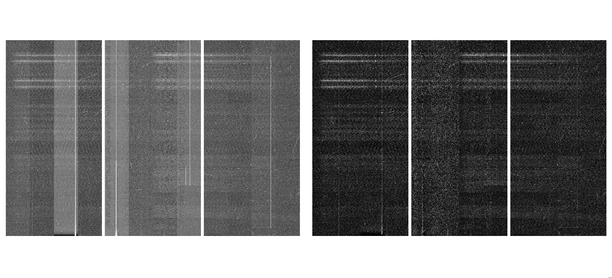
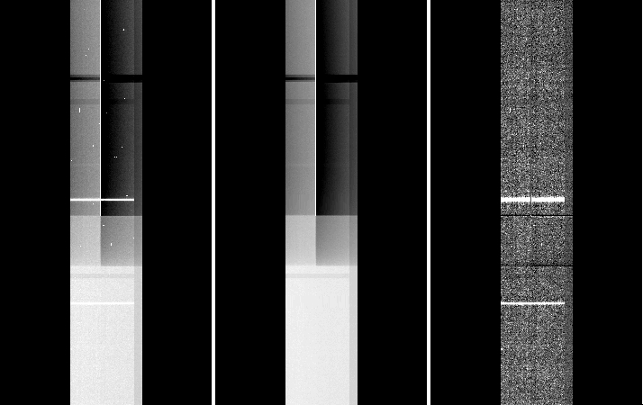

.. _appendix:

.. contents:: 
   :depth: 2
 
A.1 Bad columns treatment (all modes) on “Hamamatsu/EEV” detectors
------------------------------------------------------------------
There are bad pixel masks (BPMs) that are used for masking the bad columns. From here on “BPM” will refer to this type of mask. The masks are multi-extension .fits frames, bad pixels have a value of 1 and good pixels are 0. 

 A.1.a) How to generate the BPM

 
	- Given that the bad columns saturate after a few tens of seconds exposure time, the easiest way is to use the science data themselves for deriving the BPM. The simplest procedure is to make a copy of the science frame (and name it “mask.fits”  -do not edit the original!),  replace by zero all values below a certain upper boundary (e.g. 60000), and then all the rest by 1. The *IRAF* task ``imreplace`` is particularly handy for this since in can be run directly over each extension:

        .. code-block:: none
 
	  imreplace ("mask.fits[1]", value=0. ,lower = INDEF, upper=50000.)  # set to zero anything below UPPER
	  imreplace ("mask.fits[1]", value=1. ,lower = 1., upper=INDEF)      # set to 1. all the rest
	   …
	   …    (continue with the rest of the extensions)
	
	
This works well in most cases, particularly spectroscopy in all modes. Of course if you have saturating objects those will be masked as “bad pixels” also with this procedure.

	- If you have three or more science exposures with the same binning and ROI (e.g. three spectra) it is better to median-combine them (e.g. with ``gemcombine``) and perform the step above on the resulting median image. 


	- Since the position of the bad columns is fixed, another alternative is to generate the BPM from the columns location and width in pixels (e.g. using *IRAF* tasks ``imexpr`` and ``imreplace``).


Sometimes happens that after using the BPM (see next section) a residual bad column remains - this is due to the fact that  the bad columns generated this way (i.e. from the data) are  still too narrow. The solution is to widen them (usually by 1-2 pixels is enough).

This example *IRAF* script (download: :download:`ggbpm.02.2018feb07.cl <../scripts/ggbpm.02.2018feb07.cl>`) generates a BPM from three images and performs the widening of the bad columns. Adjustable parameters are the upper limit for column detection (the bad columns are usually above 30k counts) and the width of the kernel for the widening function (1-2 pixels). These can be modified inside the code.

Once the mask is built, you need to inspect it visually in order to check whether there are any undesired features (e.g. bright object mistakenly considered as ‘bad pixels’). In case you find such features you can manually edit or remove them with the task ``imreplace``.

 A.1.b) How to use the BPM 

In order to use this MEF BPM for correcting the bad columns in an image, the script :download:`ggbpm.04.2018jun28.cl <../scripts/ggbpm.04.2018jun28.cl>` is needed. This is basically a wrapper that runs the task ``crfix`` over each extension of the image, and updates the OBJECT header keyword.

 

A.2 Amp5 bad column saturation banding problem
----------------------------------------------

This affects only data taken while the Cboards were installed (2014jun01-2015sep01). Data is not destroyed by this, it is only a depression on the bias level. The main issue was that it varied with exposure time and over time also. To recover the correct shape, the most effective procedure is to work with extension 5 separately, mask any source signal on it in order to generate a flatfield. 

In the example below from a spectroscopic longslit observation, the extension 5 shows the ‘banding’ effect arising from the saturation of the bad column (left panel). In the middle panel, we show the result of median-combining three exposures (note that for this to work you need to have at least three spatial-dithered exposures of the same exposure time). This can be used as a flatfield. The right panel shows the result of dividing the image on the left by the median shown in the middle.   

In case you only have only one exposure, it would depend on the type of observation; but the idea is to interpolate the background across the affected area and build an ad-hoc flatfield image. The tasks ``imedit`` and ``fixpix`` are useful for this (see the example in item 6. of case 1.C)).

A.3 Biases structures
---------------------

As a general rule, using biases closest to the observing time will be the safest approach. While bias structures are found to be very stable over long periods of time, there have been various instances where these have changed significantly as a result of changes/issues with the detector electronics.

Dates: 
	I.   May 2014 and before: EEV detectors 
	II.  Jun 2014 - Aug 2015: Hamamatsu detectors with ARC47 rev. C video boards

		.. figure:: bias_Cboards.png
   		   :width: 85 %

	III. Sep 2015 - present: Hamamatsu detectors with ARC47 rev. E video boards:
		a) Sep 2015 - Jun 2016: Normal 

		.. figure:: bias_Eboards_IIIA.png
		   :width: 85 %

		b) Jul 2016 - Sep 2016: new bad columns (these remain till today, amps 3, 5, 8, 11), and mild bar-like vertical structures (a few counts above the mean bias level) on CCD2.

		.. figure:: bias_Eboards_IIIB.png
		   :width: 85 %

		c) Oct 2016 - Feb 2017: strong (100-400 counts above bias) vertical fringes on CCD2 and CCD3, and horizontal 1-pix stripes across CCD2 and CCD3.
		
		.. figure:: bias_Eboards_IIIC.png
		   :width: 85 %

		d) Mar 2017- Apr 2018: Normal

		.. figure:: bias_Eboards_IIID.png
		   :width: 85 %

		e) May 2018: same as c.
		f) Jun 2018 - present: Normal

