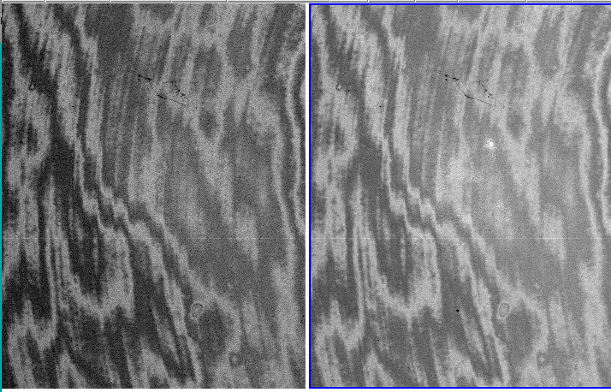
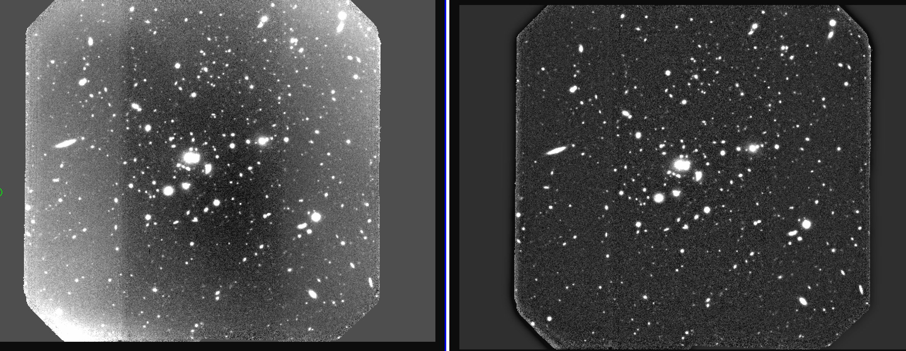
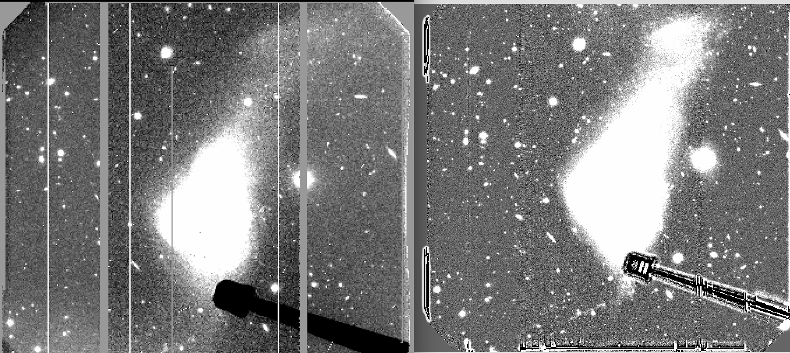

.. _imaging:

==============================================
Science imaging or MOS preimaging (full frame)
==============================================

.. contents:: 
   :depth: 2
   
.. _Case1:
   
Case 1: point source(s) or sparse field
-----------------------------------------------------

1.A) One simple procedure is to reduce the images the standard way:

	#. Subtract overscan [1]_ and bias [2]_.
	#. Mask the bad columns [3]_.
	#. Perform the QE correction on the twilights and the science frames (task ``gqecorr``)
	#. Perform the flatfield correction of science frames (and fringing [4]_ correction if suitable) using the QE corrected twilights
	#. Mosaic the images (task ``gmosaic``).

Ideally at this point the processing should be complete; however it is observed that many times  residual gradients remain. In order to correct for this, there are several possible approaches.

	6. Build an illumination correction frame from the resulting final science image (from step 5. above). First masking and removing all sources on the image (e.g. tasks ``objmasks`` and ``fixpix``, or manually). Then smoothing (using sigma values ~30 have proven to work fairly well) and normalizing the result to get the illumination correction frame. Finally divide the science image by this illumination correction [5]_.
	7. Co-add  the images (task ``gemcombine``).
 

1.B) Another way is to build the flatfield from the background sky of the actual science frames by means of the median image. This assumes a sequence of dithered images, where the dither amount is greater than the size of the source(s) of interest

	#. Subtract overscan [1]_ and bias [2]_.
	#. Mask the bad columns [3]_.
	#. Perform the QE correction on the twilights and the science frames (task ``gqecorr``)
	#. Perform the flatfield correction of science frames (and fringing [4]_ correction if suitable) using the QE corrected twilights.
	#. Build a median image from all the flatfielded science images [6]_ and normalize it to obtain the illumination correction frame.  This should not have any residual source on it. The *IRAF* task ``gemcombine`` can compute the median for GMOS MEF images.
	#. Perform the illumination correction with this normalized median frame [7]_. 

1.C) However, we found that a minimum-combined image gives better results than the median for the flat field since the removal of residuals from the sources is better. For this to work correctly, the steps are:

	#. Subtract overscan [1]_ and bias [2]_.
	#. Mask the bad columns [3]_.
	#. Perform the QE correction on the twilights and the science frames (task ``gqecorr``)
	#. Scale all images to the same value of the background sky level. This is very important for the procedure to work effectively. In *IRAF* use the task ``imstat`` over a selected background region, common to all images in order to find the mean value over that region. Then multiply by the scaling factor (if all images have the same exposure time this will be close to 1)
	#. Use the *IRAF* task ``gemexpr`` to compute the minimum-combined image: for a three image set for example:

  .. code-block:: none

    gemexpr "min(a,b,c)" result.fits scaled_image001.fits scaled_image002.fits scaled_image003.fits 
 
  where a,b,c stand for the input images (scaled_imageXXX)

	6. The result image needs to be normalized before using it as flatfield:

  .. code-block:: none

    giflat result.fits flat_result.fits 

  where flat_result is our final flat, that can now be used as any regular flat field image. After this, display the resulting flat and inspect visually whether there are any residuals. 

  .. image:: imedit_before_after.png

In case there are residuals, they can be removed manually with the task ``imedit``. 

  .. code-block:: none

		imedit flat_result[SCI,n] aperture=circular radius=100

where n is the extension number. This allows to interactively modify pixel values in the image; in thee example above, it will replace the residuals with a 100-pixel radius circular background over the cursor position upon a “b” keystroke (see the “help” of the task for more details).

	7. Perform the bad columns masking, mosaicing an coaddition as normal.

Example of a minimum-combined image (left) and a median-combined image (right). The former procedure provides better elimination of residuals (see 1.C)

Example of a flatfielded image using the standard procedure (left) and the improved flatfielding (right) described in the section "Case 1"

  
.. _Case2:

Case 2: extended objects, and/or non-dithered images 
--------------------------------------------------------------------------

This is for images in which the dithering amount is smaller than the size of the target of interest (i.e. partially overlapping offset target positions on the FOV). Also for the case of non-dithered images (either point source or extended). The idea is to fit a 2D surface to the background and then use it as a flatfield image.

2.A) In many cases the procedure listed in 1.A) is also applicable for non-dithered images and some extended objects (provided their largest linear size is no more than ~30 arcminutes). This would be the first thing to try.

2.B) If you have extended targets, but with a sequence a dithered images in which the dither amount is larger than the largest source, the procedures described in 1.B) and 1.C) can work as well.
 
2.C) If 2.A) is not applicable or the result is not satisfactory, then

	#. Subtract overscan and bias (same as above)
	#. Mask the bad columns (same as above)
	#. Fit a 2D surface to the background. If you have a sequence of dithered images, it is best to perform a median combined image (similarly as 3) above) and use this median image for fitting the 2D surface. It is also advisable to work with the individual extensions separately. For the fitting you need to use the available sky regions within the image.
	#. Use the fitted, normalized 2D surface for flatfielding the science images.

.. rubric:: Footnotes

.. [1] Overscan order must be the same throughout the reduction process. A high order for the overscan fit provides better result across the FOV (except for the bottom ___ rows)
.. [2] Bias must be overscan subtracted. The overscan fit order must be the same used in the science frames (be aware that processed bias available in the archive use the default order)

.. [3] There are different bad columns masks depending on detector "flavor" . For the *E2V* detectors there is only 1 bad column on CCD2. For the *Hamamatsu* the bad columns changed over time (see masks list vs. time).

.. [4] It is important to note that the "scale" parameter within the task ``girmfringe`` may need to be adjusted in order to remove the fringing properly (by default the auto-scale algorithms within the task are used, however not always yield the optimal result).

.. [5] There are *IRAF* tasks that build illumination correction frames, however the results is not satisfactory within the whole GMOS FOV.

.. [6] Unfortunately, just building a median (e.g. with ``gemcombine``) and using it for this doesn't work quite well (in the sense there could be significant residuals remaining)  Most times it is also necessary to mask the bright sources while constructing the median. Sometimes smoothing the median is also advisable. 

.. [7] If there are negative residuals, then the masking and/or smoothing when construction the median flat needs to be improved.

