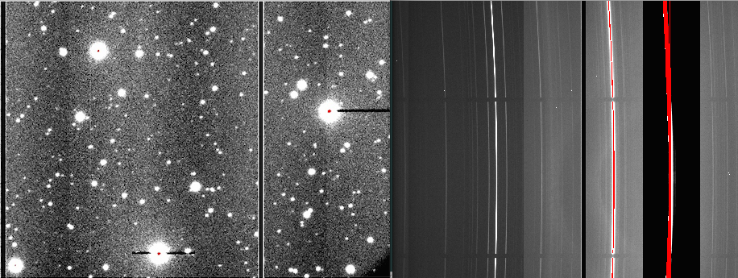
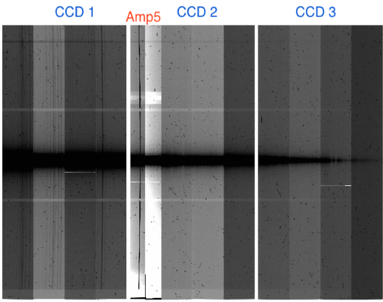
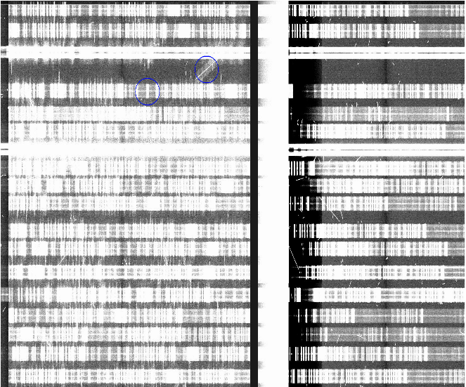
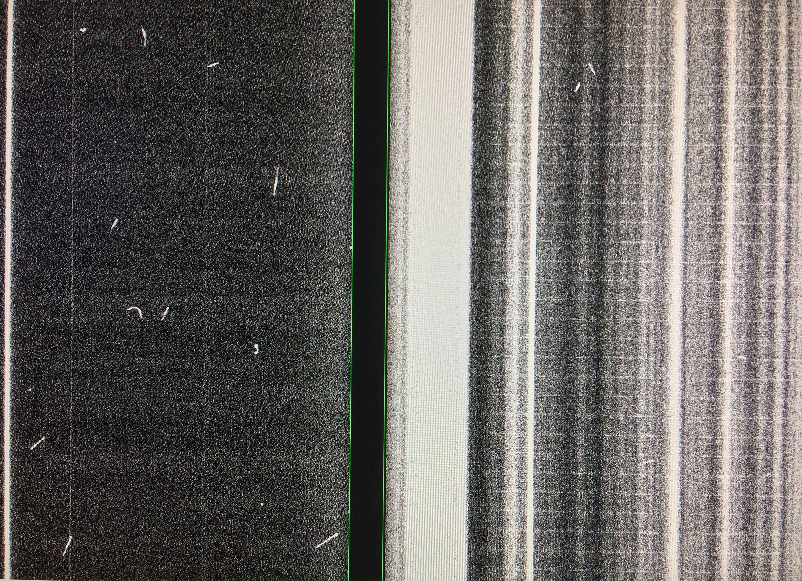
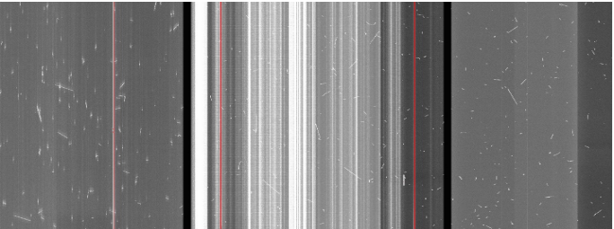

.. _dates:

==========================
Dates & Status of the detectors
==========================
.. contents:: 
   :depth: 2
   
Dates
----------

The dates are structured as follows:

:June 11, 2014:  
The `saturation banding in binned data <http://www.gemini.edu/sciops/instruments/gmos/imaging/detector-array/gmoss-array-hamamatsu>`_ effect is a lowering in counts (with respect to the bias level) that happens when one or more pixels saturate, affecting the whole amplifier width. 

:August 22, 2014: 
	GMOS-S was back on sky after the controller backplane was replaced during the telescope shutdown, and the problem was gone.

:February, 2015: 
A banding issue and accumulating spurious charge on amplifier #5 (in CCD2) and bad columns appear.

:May,2015 - July, 2015: 
	Another problem namely a charge transfer issue affecting CCD1 in Nod and Shuffle data. The end of July 2015 the CCD1 CTE problem was spontaneously gone and permanently fixed the saturation 'banding' problem. 

   
:End of June, 2016: 
	New bad columns developed and some bar-like vertical structures appeared having a few counts above the mean bias level on CCD2. 

:September, 2016: 
	More new features appeared on GMOS-S raw data, the most notable features being vertical fringes on CCD2 and CCD3. The dominant bias features are not uniform but highly structured (bright, vertical lanes). The noise is enhanced at the location of these features, which can affect spectroscopy of faint targets, particularly in MOS and IFU observations. 

   
:September, 2016: 
	A sporadic appearance of a hint of CTE issues on CCD1 was noticed in N&S observation from. A slight charge smear is evident in comparison with CCD2 and CCD3, in a 8-cycle N&S exposure. In contrast recent 17A 20-cycles N&S exposures show no signs for a degraded CTE. 

   
Status of the detectors
------------------------------

:Status and Availability:  http://www.gemini.edu/sciops/instruments/gmos/status-and-availability

Summary, 2018: 
^^^^^^^^^^^^^^

-  CCD1:  One bad column, saturating, 5 pix wide, on amp#3. 

-  CCD2:  Three bad columns: one on amp#5 (saturating in a few minutes, 8 pix wide) and two on amp#8 (first one 3pix wide, ~300 counts; second one 5 pix wide and saturating in ~25 minutes). 

-  CCD3:  One bad column on amp#11 (saturating in ~20 minutes, 5 pix wide). 
